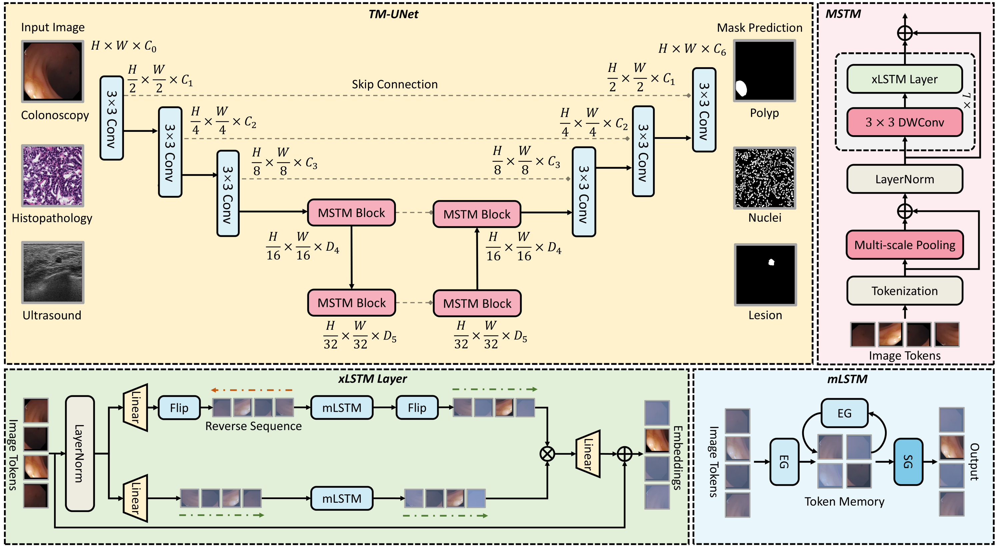

# TM-UNet: Token-Memory Enhanced Sequential Modeling for Efficient Medical Image Segmentation

### [ArXiv Paper]() 

[Yaxuan Jiao]()<sup>1*</sup> [Qing Xu](https://scholar.google.com/citations?user=IzA-Ij8AAAAJ&hl=en&authuser=1)<sup>2,3,5*</sup> [Yuxiang Luo]()<sup>4*</sup> [Xiangjian He]()<sup>5*</sup> [Zhen Chen](https://franciszchen.github.io/)<sup>6✉</sup> [Wenting Duan](https://scholar.google.com/citations?user=H9C0tX0AAAAJ&hl=en&authuser=1)<sup>2</sup>

<sup>1</sup>Dalian University of Technology &emsp; <sup>2</sup>University of Lincoln &emsp; <sup>3</sup>Univeristy of Nottingham &emsp; <sup>4</sup>Waseda University &emsp; <sup>5</sup>University of Nottingham Ningbo China &emsp; <sup>6</sup>Yale University &emsp;

<sup>*</sup> Equal Contribution. <sup>✉</sup> Corresponding Author. 

-------------------------------------------


## 📰News

- **[2025.11.15]** We have released the code for TM-UNet!
## 🛠Setup

```bash
git clone https://github.com/xq141839/TM-UNet.git
cd TM-UNet
```

**Key requirements**: Cuda 12.2+, PyTorch 2.4+

The data structure is as follows.
```
TM-UNet
├── datasets
│   ├── image
│     ├── dataset01_001.png
|     ├── ...
|   ├── mask
│     ├── dataset01_001.png
|     ├── ...
|   ├── dataset01_data_split.json
    ├── ...
```
The json structure is as follows.

    { 
     "train": ['dataset01_001.png', 'dataset01_004.png'],
     "valid": ['dataset01_002.png'],
     "test":  ['dataset01_003.png'] 
     }

## 📜Citation
If you find this work helpful for your project, please consider citing the following paper:


## Acknowledgements

* [Vision-xLSTM](https://github.com/NX-AI/vision-lstm)
* [PoolFormer](https://github.com/sail-sg/poolformer)

